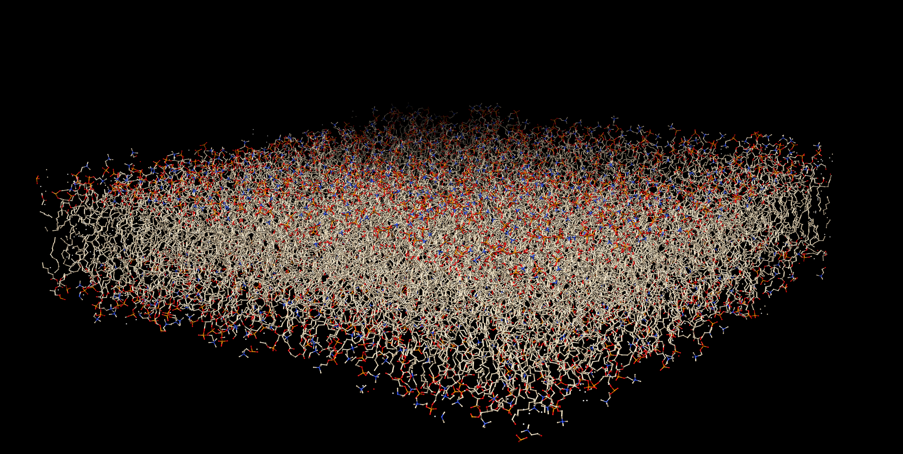
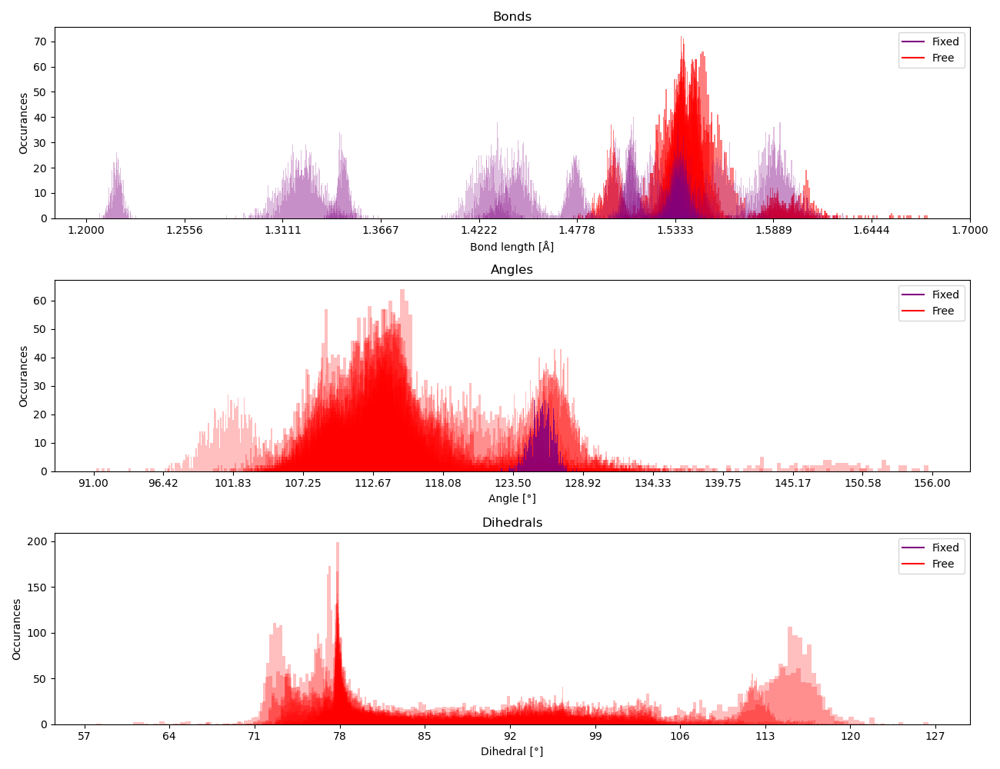
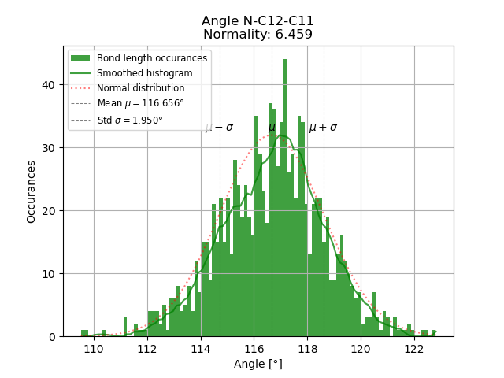

# MEMDOF - Membrane Degrees Of Freedoms



## Introduction

MEMDOF (Membrane Degrees Of Freedoms) is a Python package designed for analyzing and visualizing the internal degrees of freedom within molecular structures. This tool aims to aid researchers and scientists in understanding the dynamic behavior and flexibility of membrane proteins by providing detailed insights into the fixed and free states of bonds, angles, and dihedral angles within a structure.
Degrees of freedom here refer to the complexity of the distribution of a given internal coordinate in a molecular system. The internal degrees of freedom (IDOF) are calculated based on the topology information of the molecular structure and the coordinates of the atoms in the structure. The IDOF analysis can be used to identify the most flexible regions of a protein, which can be useful for understanding the protein's function and behavior in molecular dynamics simulations especially in the context of machine learning.

## Features

- Parsing of GROMACS topology files (.itp) to extract topology information.
- Analysis of internal degrees of freedom (IDOF) for bonds, angles, and dihedrals.
- Visualization of distribution and normality tests for molecular dynamics.
- Support for periodic boundary conditions.
- Data export in both graphical and CSV formats for further analysis.

## Installation

MEMDOF can be installed using pip:

```bash
pip install memdof
```

Ensure you have Python 3.6 or higher installed before proceeding.

## Usage

### Basic Usage

To analyze a PDB file and visualize the internal degrees of freedom, you can use MEMDOF as follows:

```python
from memdof import parse_PTB, calc_IDOF, parse_topology

# Parse the topology information from a GROMACS topology file (.itp)
topology_info = parse_topology('path/to/your/topology/file.itp')

# Parse the PDB file to extract the structure
structure, pbc = parse_PTB('path/to/your/structure/file.pdb')

# Calculate the internal degrees of freedom
extended_topology_info = calc_IDOF(structure, pbc, topology_info, create_plots=True, plots_path='path/to/save/plots', create_csv=True, csv_path='path/to/save/csvs')
```

This will generate plots and CSV files in the specified directories, showing the distribution of internal degrees of freedom for bonds, angles, and dihedrals in the structure. For example, the following plots are generated:




## Contributing

Contributions to MEMDOF are welcome! If you'd like to contribute, please fork the repository, create a feature branch, and submit a pull request.

## Licensing

MEMDOF is licensed under the MIT license. See the LICENSE file in the repository for more details.
